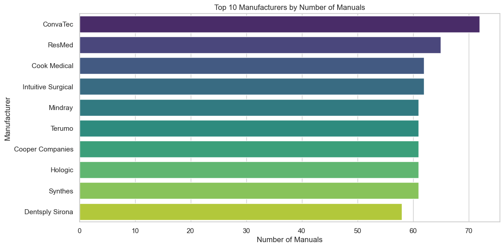
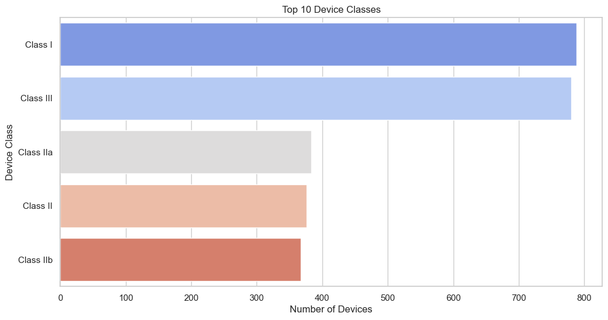
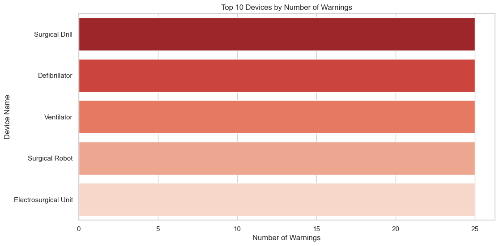
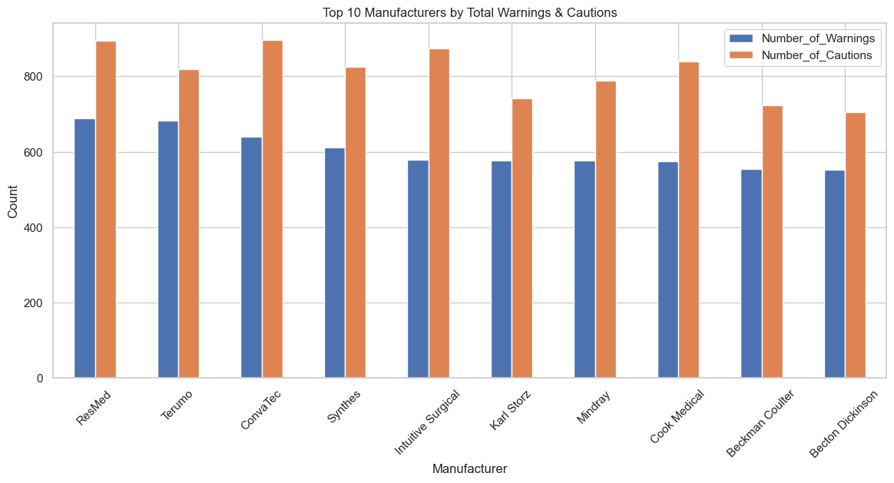
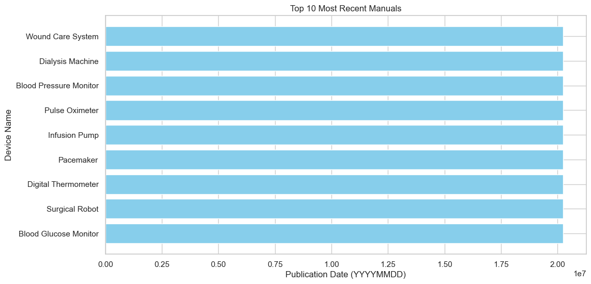

```python
# ===================================================
# Medical Device Manuals Analysis & Visualization
# ===================================================

# 1️⃣ Import Libraries
import pandas as pd
import matplotlib.pyplot as plt
import seaborn as sns

# Set Seaborn style
sns.set(style="whitegrid")

# ===================================================
# 2️⃣ Load Dataset
# ===================================================
df = pd.read_csv("C:/Users/PC/Downloads/archive (2)/medical_dataset.csv")

# Quick check
print("Dataset shape:", df.shape)
print(df.head())


```

    Dataset shape: (2694, 16)
                  Device_Name Model_Number            Manufacturer Manual_Version  \
    0            Insulin Pump       DAN246                 Danaher      2023-05-C   
    1              Ventilator   Model 4428  Fresenius Medical Care           v8.4   
    2          Surgical Robot       ABB102                  Abbott     Version 10   
    3  Blood Pressure Monitor      Plus269         Dentsply Sirona       Rev. 8.7   
    4          Pulse Oximeter       SYN478                 Synthes      Rev. 10.9   
    
      Publication_Date Device_Class Regulatory_Approval_ID   Patient_Population  \
    0       2022-01-27      Class I              NDA412861  Adult and Pediatric   
    1       2015-11-01     Class II              IDE380253                Adult   
    2       2015-12-03      Class I                H394827            Pediatric   
    3       2020-03-18    Class III              NDA972045  Adult and Pediatric   
    4       2016-08-28    Class IIa            PMDA-850639                  All   
    
                                     Indications_for_Use  \
    0  Indicated for real-time heart rate assessment ...   
    1  Intended for infection control evaluation in r...   
    2  Intended for infection control therapy in inte...   
    3  Indicated for emergency pulmonary function sta...   
    4  Used for emergency joint replacement in acute ...   
    
                                       Contraindications  \
    0  Not recommended for use in radiation therapy p...   
    1  Not recommended in presence of pulmonary edema...   
    2  Not recommended for use in burn patients or th...   
    3  Not recommended for patients with autoimmune d...   
    4  Contraindicated in patients with thrombocytope...   
    
           Sterilization_Method  Number_of_Warnings  Number_of_Cautions  \
    0                       NaN                  11                  11   
    1        Single-Use Sterile                  25                  13   
    2  Hydrogen Peroxide Plasma                  14                  28   
    3            Pre-Sterilized                   7                  20   
    4      Ethylene Oxide (EtO)                   3                   4   
    
       Device_Lifetime_Years  Device_Weight_kg  Max_Operating_Temperature_C  
    0                    5.0              7.85                         12.0  
    1                    8.0             69.53                         26.0  
    2                    8.0             10.61                         39.0  
    3                    9.0              7.64                         30.0  
    4                    7.0              0.32                         35.0  
    


```python
# ===================================================
# 3️⃣ Basic Data Cleaning (just in case)
# ===================================================
# Fill missing values (should already be cleaned in SQL)
df.fillna({
    'Manufacturer': 'Unknown',
    'Device_Class': 'Unknown',
    'Number_of_Warnings': 0,
    'Number_of_Cautions': 0,
    'Device_Lifetime_Years': 0,
    'Device_Weight_kg': 0,
    'Max_Operating_Temperature_C': 25
}, inplace=True)

# ===================================================
# 4️⃣ Top 10 Manufacturers by Number of Manuals
# ===================================================
top_manufacturers = df['Manufacturer'].value_counts().head(10)
print(top_manufacturers)

plt.figure(figsize=(12,6))
sns.barplot(x=top_manufacturers.values, y=top_manufacturers.index, palette='viridis')
plt.title('Top 10 Manufacturers by Number of Manuals')
plt.xlabel('Number of Manuals')
plt.ylabel('Manufacturer')
plt.show()
```

    ConvaTec              72
    ResMed                65
    Cook Medical          62
    Intuitive Surgical    62
    Mindray               61
    Terumo                61
    Cooper Companies      61
    Hologic               61
    Synthes               61
    Dentsply Sirona       58
    Name: Manufacturer, dtype: int64
    


    

    


```python
# ===================================================
# 5️⃣ Top 10 Device Classes
# ===================================================
top_device_classes = df['Device_Class'].value_counts().head(10)
print(top_device_classes)

plt.figure(figsize=(12,6))
sns.barplot(x=top_device_classes.values, y=top_device_classes.index, palette='coolwarm')
plt.title('Top 10 Device Classes')
plt.xlabel('Number of Devices')
plt.ylabel('Device Class')
plt.show()
```

    Class I      788
    Class III    780
    Class IIa    383
    Class II     376
    Class IIb    367
    Name: Device_Class, dtype: int64
    


    

    


```python
# ===================================================
# 6️⃣ Devices with Most Warnings
# ===================================================
top_warnings = df[['Device_Name', 'Number_of_Warnings']].sort_values(by='Number_of_Warnings', ascending=False).head(10)
print(top_warnings)

plt.figure(figsize=(12,6))
sns.barplot(x='Number_of_Warnings', y='Device_Name', data=top_warnings, palette='Reds_r')
plt.title('Top 10 Devices by Number of Warnings')
plt.xlabel('Number of Warnings')
plt.ylabel('Device Name')
plt.show()
```

                   Device_Name  Number_of_Warnings
    257         Surgical Drill                  25
    1104         Defibrillator                  25
    1               Ventilator                  25
    2192         Defibrillator                  25
    1826        Surgical Robot                  25
    445             Ventilator                  25
    826          Defibrillator                  25
    2580         Defibrillator                  25
    1096  Electrosurgical Unit                  25
    2115            Ventilator                  25
    


    

    


```python
# ===================================================
# 7️⃣ Manufacturers with Most Total Warnings
# ===================================================
warnings_by_manufacturer = df.groupby('Manufacturer')[['Number_of_Warnings', 'Number_of_Cautions']].sum().sort_values(by='Number_of_Warnings', ascending=False).head(10)
print(warnings_by_manufacturer)

warnings_by_manufacturer.plot(kind='bar', figsize=(14,6))
plt.title('Top 10 Manufacturers by Total Warnings & Cautions')
plt.xlabel('Manufacturer')
plt.ylabel('Count')
plt.xticks(rotation=45)
plt.show()
```

                        Number_of_Warnings  Number_of_Cautions
    Manufacturer                                              
    ResMed                             688                 894
    Terumo                             682                 820
    ConvaTec                           639                 897
    Synthes                            611                 825
    Intuitive Surgical                 578                 875
    Karl Storz                         577                 741
    Mindray                            577                 789
    Cook Medical                       575                 839
    Beckman Coulter                    555                 723
    Becton Dickinson                   553                 705
    


    

    


```python
# ===================================================
# 8️⃣ Most Recent Manuals
# ===================================================
import matplotlib.pyplot as plt

# Get most recent 10 manuals
recent_manuals = df[['Device_Name', 'Publication_Date']].sort_values(by='Publication_Date', ascending=False).head(10)

# Convert Publication_Date to numeric YYYYMMDD
recent_manuals['Publication_Date_Num'] = recent_manuals['Publication_Date'].dt.strftime('%Y%m%d').astype(int)

# Horizontal bar chart
plt.figure(figsize=(12,6))
plt.barh(recent_manuals['Device_Name'], recent_manuals['Publication_Date_Num'], color='skyblue')
plt.xlabel('Publication Date (YYYYMMDD)')
plt.ylabel('Device Name')
plt.title('Top 10 Most Recent Manuals')
plt.gca().invert_yaxis()  # Most recent on top
plt.show()
```


    

    


```python

```
